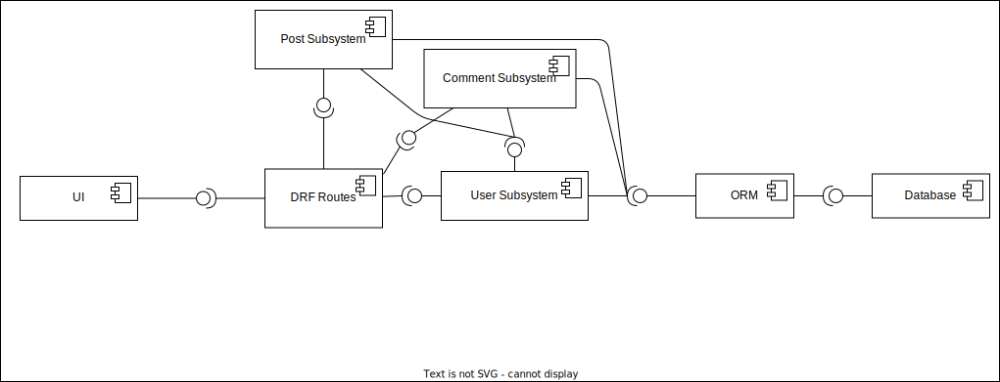
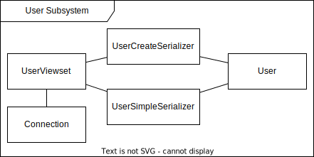

# Design

## System Architecture

- Three tier architecture
    - Client
    - Application Server
    - Data Server

## Subsystem Decomposition
- Component Diagram
    
    

### User Subsystem

- Handles signup and login.
- Components:
    - User: Entity/Model for the User class saved on Database
    - UserViewset: Handles signup/login related requests
    - UserCreateSerializer: DTO for signup, expects all information including password
    - UserSimpleSerializer: DTO for getting user information, returns only necessary details.

