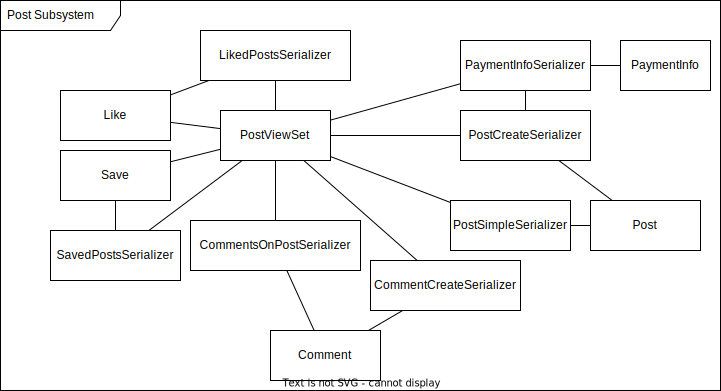
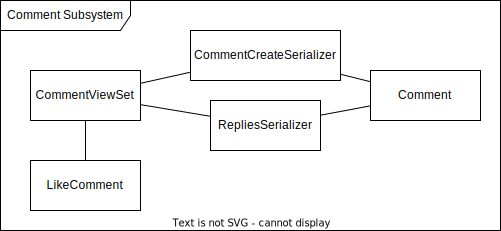

# Design

## System Architecture

- Three tier architecture
    - Client
    - Application Server
    - Data Server

## Subsystem Decomposition
- Component Diagram
    
    

### User Subsystem

- Handles signup, login, and new connection.
- Components:
    - User: Entity/Model for the User class saved on Database
    - Connection: Entity/Model for the Connection class saved on Database
    - UserViewset: Handles signup/login and new connection requests
    - UserCreateSerializer: DTO for signup, expects all information including password
    - UserSimpleSerializer: DTO for getting user information, returns only necessary details.

### Post Subsystem

- Handles creating, archiving, liking, commenting on and saving posts.
- Components:
    - Post: Entity/Model for the Post class saved on Database
    - Like: Entity/Model for the Like class saved on Database
    - Comment: Entity/Model for the Comment class saved on Database
    - Save: Entity/Model for the Save class saved on Database
    - PaymentInfo: Entity/Model for the PaymentInfo class saved on Database
    - PostViewset: Handles post related requests
    - PostCreateSerializer: DTO for creating a post, expects all information including payment info
    - PostListSerializer: DTO for getting post information, returns only necessary details.

### Comment Subsystem

- Handles liking and replying to comments.
- Components:
    - Comment: Entity/Model for the Comment class saved on Database
    - LikeComment: Entity/Model for the Like class saved on Database
    - CommentViewset: Handles comment related requests

