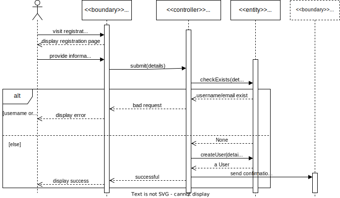
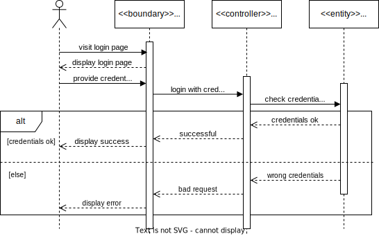
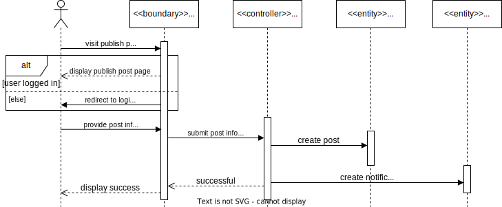
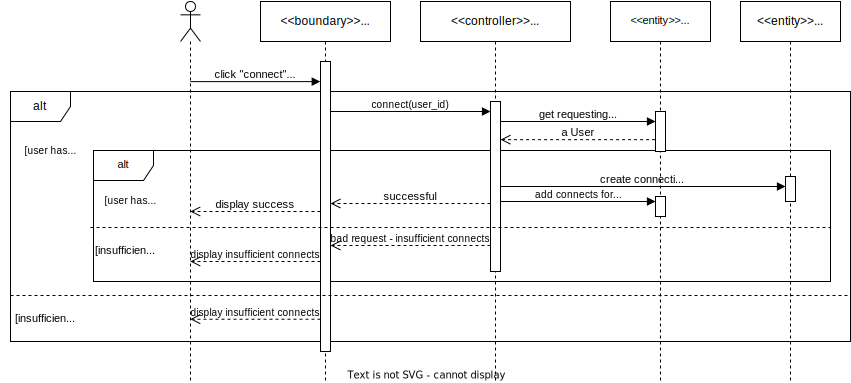
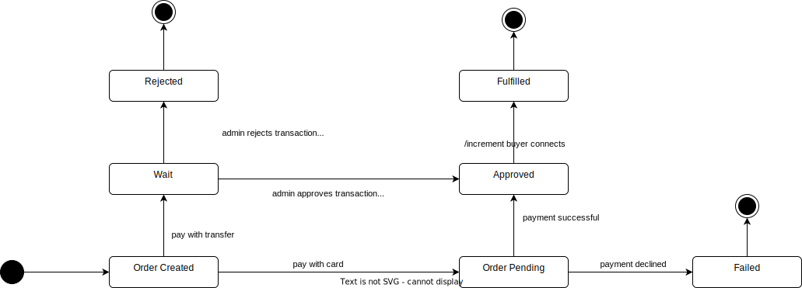
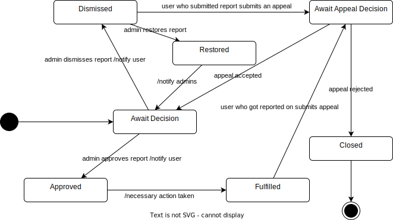
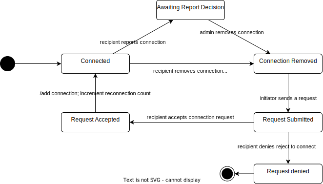

# Requirements Analysis

## Current System

We found that the apps available as of writing this report are either using communities (7 cups) or posting anonymously (i.e. Ventscape).

## Problem with the Existing System
- Not user friendly.
- Some don't even work.
- Paywall (no free trial). i.e. Ventnow.ai
- A lot of questions asked before using the app (score cards). 

## Actors
- **User**: vents in the app, sends donations, chats with other users, likes, comments, shares, saves posts.
- **Admin**: customer support (including payments), moderate reported posts and users.
- **Superuser**: manages the system, has access to all data.

## Functional Requirements
Essential features.

### Account Management

- ✅ *FR1.1*: The system shall allow Users to register (with their profile picture, name, email, username, and password), and login with their email and password.
- ✅ *FR1.2*: The system shall allow Users to manage their account (edit profile picture, name)

### Post

- ✅ *FR2.1*: The system shall allow Users to post (text, images, payment details)
- ✅ *FR2.2*: The system shall allow Users to archive their previous posts.
- ✅ *FR2.3*: The system shall allow Users to add more payment details to any of their active posts but not delete or edit any of their previous payment details on a post.

### Interactions

- ✅ *FR3.1*: The system shall allow Users to like, comment, share, save posts.
- ✅ *FR3.2*: The system shall allow Users to like and comment on comments.

### Analytics
- *FR4.1*: The system shall allow Users to see their own Analytics summary (views, likes, comments).

### Buying Connects
- ✅ *FR5.1*: The system shall allow Users to buy connects either with card or manual payments (transfers).
- ✅ *FR5.2*: The system shall provide multiple options for manual payments.
- ✅ *FR5.3*: The system shall allow Users to select their preferred payment method, currency, amount of connects to buy, and the amount to send (in their preferred currency) - lead users to contact support if they don't find their preferred payment method.

### Manual payments & Appeals
- *FR6.1*: The system shall allow Users to see their pending, approved, and rejected manual payments.
- ✅ *FR6.2*: The system shall allow Users to submit an appeal for rejected payments.
- *FR6.3*: The system shall allow Users to view pending, approved (automatically approves the manual payment), and rejected (final) appeals.

### Connections
- ✅ *FR7.1*: The system shall allow Users to connect with other users.
- ✅ *FR7.2*: The system shall allow Users to see their connections' public payment details on their posts.
- ✅ *FR7.3*: The system shall allow Users to donate to their connections.
- *FR7.4*: The system shall allow Users to chat with their connections.

### Connects History & Monthly Free Connects
- *FR8.1*: The system shall allow Users to receive connects from incoming connections.
- *FR8.2*: The system shall give free connects to users every month.
- *FR8.3*: The system shall allow Users to view their connects history (buy, spend, receive).

### Chat

- *FR9.1*: The system shall categorize incoming text as Requests and allow Users to move the conversation to `Primary` and `Secondary`
- *FR9.2*: The system shall allow Users to `Archive` conversations and add them to `Archived` category.
- *FR9.3*: The system shall allow Users to send posts to conversations in the system chat.
- *FR9.5*: The system shall allow Users to create group conversations (v2).
- *FR9.6*: The system shall allow Users to react (emojis), reply, forward (in the same conversation), report messages in a conversation.

### Feed & Search
- ✅ *FR10.1*: The system shall allow Users to discover other posts in their feed.
- *FR10.2*: The system shall allow Users to Search for posts.
- *FR10.3*: The system shall allow Users to Search other users by their Username, visit their profile and view their previous posts.

### Reporting

- *FR11.1*: The system shall allow Users to report on posts.

### Support

- ✅ *FR12.1*: The system shall allow Users to contact support (whatsapp, chat) and view all admins.

### Manual Payments Management

- ✅ *FR13.1*: The system shall allow admins to view, approve or reject manual payments for connects.
- ✅ *FR13.2*: The system shall allow admins to see all manual payments.

### Reports Management

- *FR14.1*: The system shall allow admins to see all reported posts.
- *FR14.2*: The system shall allow admins to moderate reported posts.
- *FR14.3*: The system shall allow admins to temporarily disable posting, liking and commenting for users.
- *FR14.4*: The system shall allow Users to see banned Users.
- *FR14.5*: The system shall allow admins to view reported messages.
- *FR14.6*: The system shall allow admins to remove a connection (permanently) based on a reported message.
- ✅ *FR14.7*: The system shall allow admins to view, approve and reject appeals.
- ✅ *FR14.8*: The system shall allow admins to dismiss reports.
- *FR14.9*: The system shall allow admins to see dismissed reports.
- *FR14.10*: The system shall allow admins to restore dismissed reports.

### Track Admin Actions

- ✅ *FR15.1*: The system shall track admin actions.

## Non-Functional Requirements

### Account Management
- *NFR1.1*: Login sessions must persist across devices, with instant logout when a session is revoked.
- *NFR1.2*: Passwords must never be visible to admins, even in logs or exports.

### Posts
- *NFR2.1*: Post creation must support background upload for media (user can continue app use).
- *NFR2.2*: Archived posts must remain accessible only to the post owner, with no public links available.

### Interactions
- *NFR3.1*: Likes, comments, shares, and saves must update dynamically without requiring page refresh.
- *NFR3.2*: Comment threads must auto-update when new replies arrive.
- *NFR3.3*: Duplicate reactions (same user liking multiple times) must be prevented in real-time.

### Analytics
- *NFR4.1*: Analytics must not expose private user identities (only counts unless user made public).

### Buying Connects
- *NFR5.1*: Payment gateway integrations must return clear error messages when a payment fails.

- *NFR5.2*: Manual payment instructions must be localized (currency, method) for user’s region.

- *NFR5.3*: Users must be redirected to support within the flow if their preferred payment method isn’t found.

### Manual Payments & Appeals
- *NFR6.1*: Appeals must be immutable once submitted (cannot be edited afterward).
- *NFR6.2*: Users must receive real-time notification when appeal results are updated.

### Connections
- *NFR7.1*: Users must not be able to view another user’s payment details unless they are connected.
- *NFR7.2*: Chat initiation must only be possible between connected users (no bypassing).

### Connects History & Monthly Free Connects
- *NFR8.1*: Connects history must remain immutable (no retroactive edits/deletions).

- *NFR8.2*: Monthly free connects must auto-renew without manual claim by users.

- *NFR8.3*: Connects balances must update instantly after a transaction.

### Chat
- *NFR9.1*: Messages must appear in real-time without refresh (WebSockets).

- *NFR9.2*: Typing indicators and message read status must sync across all active devices.

- *NFR9.3*: Archived conversations must not generate notifications.

- *NFR9.4*: Forwarded messages must preserve original metadata (sender, timestamp).

- *NFR9.5*: Reactions must update instantly for all participants in the conversation.

- *NFR9.6*: Reported messages must show in a warning background from the reporting user's view.

### Feed & Search
No non-functional requirements.

### Reporting
- *NFR11.1*: Reported content must be hidden from the reporter’s view immediately.

- *NFR11.2*: Duplicate reports from the same user on the same content must be blocked.

### Support
- *NFR12.1*: Admin availability must update in real-time (online/offline indicators).

### Manual Payments Management
- *NFR13.1*: Admin approval/rejection must trigger immediate updates for the user.

- *NFR13.2*: Admin actions must be logged with timestamp and actor ID.

### Reports Management
- *NFR14.1*: Admin moderation actions must propagate immediately (e.g., disabling a user).

- *NFR14.2*: Temporarily disabled users must see a clear in-app notice about restrictions.

- *NFR14.3*: Restored dismissed reports must return to the active moderation queue automatically.

### Admin – Tracking Actions
- *NFR15.1*: All admin actions must be immutable and exportable for audits.

- *NFR15.2*: Audit logs must be viewable by superuser and all admins.

## Use Case Model

### Use Case Diagram

### Use Case Description

#### Use Case: Register

| Field | Description |
|-------|-------------|
| Use Case ID | UC-01 |
| Use Case Name | Register |
| Participating Actor | User |
| Use Case Description | User registers to the system. |
| Pre-Condition | User is not logged in. |
| Post-Condition | User is registered. |
| Flow of events | 1. User goes to the registration page.  2. User provides their information.   3. The system checks that the email provided and the username are not already registered.   4. The user is registered.   6. A confirmation email is sent to the user. |
| Alternative Flow 3a - Already Registered | 3.a Show error message to user on the field. |

#### Use Case: Login

| Field | Description |
|-------|-------------|
| Use Case ID | UC-02 |
| Use Case Name | Login | 
| Participating Actor | User |
| Use Case Description | User Logs in the system. |
| Pre-Condition | User is not logged in. |
| Post-Condition | User is logged in. |
| Flow of events | 1. User goes to the login page.   2. User provides their email and password.   3. The system checks that the email provided and the password are correct.   4. The user is logged in. |
| Alternative Flow 3a - Invalid Credentials | 3.a Show error message to user. |

#### Use Case: Manage Account

| Field | Description |
|-------|-------------|
| Use Case ID | UC-03 |
| Use Case Name | Manage Account | 
| Participating Actor | User |
| Use Case Description | User manages their account. |
| Pre-Condition | User is logged in. |
| Post-Condition | Changes to user account are saved. |
| Flow of events | 1. User goes to their profile page.   2. User changes their information.   3. The system updates the user's account. |

#### Use Case: Publish Post

| Field | Description |
|-------|-------------|
| Use Case ID | UC-04 |
| Use Case Name | Publish Post | 
| Participating Actor | User |
| Use Case Description | User publishes a post. |
| Pre-Condition | 1. User is logged in.   2. User has no restrictions on posting. |
| Post-Condition | Post is published. |
| Flow of events | 1. User goes to the post creation page.   2. User provides their post information.   3. The system creates the post.   4. The system notifies connections. |

#### Use Case: Archive Post

| Field | Description |
|-------|-------------|
| Use Case ID | UC-05 |
| Use Case Name | Archive Post | 
| Participating Actor | User |
| Use Case Description | User archives a post. |
| Pre-Condition | 1. User is logged in.   2. The post is published by the user. |
| Post-Condition | Post is archived. |
| Flow of events | 1. User goes to their profile page.   2. User clicks to archive one of their posts.   3. The system archives the post. |

#### Use Case: Interact with Post

| Field | Description |
|-------|-------------|
| Use Case ID | UC-06 |
| Use Case Name | Interact with Post | 
| Participating Actor | User |
| Use Case Description | User interacts with a post (likes, comments, shares, saves). |
| Pre-Condition | 1. User is logged in.   2. User has no restrictions on interacting with posts. |
| Post-Condition | Post interaction is saved on the system and reflected in the UI. |
| Flow of events | 1. User finds a post.   2. User interacts with a post.   3. The system saves the post interaction.   4. The UI on the other users' devices updates. |

#### Use Case: Interact with Comments

| Field | Description |
|-------|-------------|
| Use Case ID | UC-07 |
| Use Case Name | Interact with Comments | 
| Participating Actor | User |
| Use Case Description | User interacts with a comment (likes, replies). |
| Pre-Condition | 1. User is logged in.   2. User has no restrictions on interacting with comments. |
| Post-Condition | Comment interaction is saved on the system and reflected in the UI. |
| Flow of events | 1. User finds a comment under a post.   2. User interacts with a comment.   3. The system saves the comment interaction.   4. The UI on the other users' devices updates. |

#### Use Case: Buy Connects

| Field | Description |
|-------|-------------|
| Use Case ID | UC-08 |
| Use Case Name | Buy Connects | 
| Participating Actor | User |
| Use Case Description | User buys connects either with card or manual payment (transfer). |
| Pre-Condition | User is logged in. |
| Post-Condition | Connects are added to the user's account. |
| Flow of events | 1. User goes to the buy connects page.   2. User selects the number of connects they want to buy and their payment method.   3. The user provides their card information.   4. The system processes the payment.   5. The system adds the connects to the user's account. |
| Alternative Flow 2a - Manual Payment | 2.a1 The system provides the manual payment instructions.   2.a2 The user submits the screenshot of the transfer.   2.a3 The system adds the manual payment in a queue for approval. |

#### Use Case: Contact Support

| Field | Description |
|-------|-------------|
| Use Case ID | UC-09 |
| Use Case Name | Contact Support | 
| Participating Actor | User |
| Use Case Description | User contacts support. |
| Pre-Condition | User is logged in. |
| Post-Condition | Support is notified. |
| Flow of events | 1. User goes to the contact support icon.   2. User provides their support request.   3. The system sends the support request to support. |
| Alternative Flow 1a - Manual Payments | 1.a1 The user can't continue with their manual payment.   1.a2 The user clicks on the contact support button.   1.a3 Continue from step 2. |

#### Use Case: Submit an Appeal

| Field | Description |
|-------|-------------|
| Use Case ID | UC-10 |
| Use Case Name | Submit an Appeal | 
| Participating Actor | User |
| Use Case Description | User submits an appeal. |
| Pre-Condition | 1. User is logged in.   2. The user has a restriction or a manual payment that was rejected. |
| Post-Condition | Appeal is submitted. |
| Flow of events | 1. User finds a notification about a restriction or a manual payment that was rejected.   2. User clicks on the submit an appeal button.   3. User provides their appeal request.   4. The system sends the appeal request to support. |

#### Use Case: Add Connections

| Field | Description |
|-------|-------------|
| Use Case ID | UC-11 |
| Use Case Name | Add Connections | 
| Participating Actor | User |
| Use Case Description | A new connection is made. |
| Pre-Condition | 1. User is logged in.   2. User has enough connects to add a new connection. |
| Post-Condition | Connection is added to both users' accounts. |
| Flow of events | 1. User finds another user's profile or post.   2. User clicks on the Connect button.   3. The system adds the connection to both users' accounts.   4. The connects spent to create the connection are added to the other user's account. |

#### Use Case: Donate to Connections

| Field | Description |
|-------|-------------|
| Use Case ID | UC-12 |
| Use Case Name | Donate to Connections | 
| Participating Actor | User |
| Use Case Description | User donates to a connection. |
| Pre-Condition | 1. User is logged in.   2. User is connected to the other user to donate to. |
| Post-Condition | The UI shows the details on how to send the donations. |
| Flow of events | 1. User finds another user's post.   2. User clicks on the Donate button.   3. The system shows the details on how to send the donations. |

#### Use Case: Chat with Connections

| Field | Description |
|-------|-------------|
| Use Case ID | UC-13 |
| Use Case Name | Chat with Connections | 
| Participating Actor | User |
| Use Case Description | User chats with a connection. |
| Pre-Condition | 1. User is logged in.   2. User is connected to the other user to chat with. |
| Post-Condition | The chat is started or user is taken to the existing chat. |
| Flow of events | 1. User finds another user's post or profile.   2. User clicks on the Chat button.   3. The system creates the chat or takes the user to the existing chat. |

#### Use Case: Archive Conversation

| Field | Description |
|-------|-------------|
| Use Case ID | UC-14 |
| Use Case Name | Archive Conversation | 
| Participating Actor | User |
| Use Case Description | User archives a conversation. |
| Pre-Condition | 1. User is logged in.   2. The conversation exists.   3. The conversation is not archived. |
| Post-Condition | Conversation is archived. |
| Flow of events | 1. User finds a conversation.   2. User clicks on the Archive button.   3. The system archives the conversation. |

#### Use Case: Send Post in Chat

| Field | Description |
|-------|-------------|
| Use Case ID | UC-15 |
| Use Case Name | Send Post in Chat | 
| Participating Actor | User |
| Use Case Description | User sends a post in a chat. |
| Pre-Condition | 1. User is logged in.   2. The chat exists.   3. The user still maintains a connection with the other user (not restricted). |
| Post-Condition | Post is sent in the chat. |
| Flow of events | 1. User finds a post.   2. User clicks on the Send button.   3. The user chooses a connection to send the post to.   4. The system sends the post in the chat (create a new chat if it doesn't exist). |

#### Use Case: Interact with Messages

| Field | Description |
|-------|-------------|
| Use Case ID | UC-16 |
| Use Case Name | Interact with Messages | 
| Participating Actor | User |
| Use Case Description | User interacts with a message (likes, replies). |
| Pre-Condition | 1. User is logged in.   2. The message exists.   3. The user still maintains a connection with the other user (not restricted). |
| Post-Condition | Message interaction is saved on the system and reflected in the UI immediately. |
| Flow of events | 1. User finds a message.   2. User interacts with a message.   3. The system saves the message interaction.   4. The UI on the other users' devices updates immediately. |

#### Use Case: Search Posts

| Field | Description |
|-------|-------------|
| Use Case ID | UC-17 |
| Use Case Name | Search Posts | 
| Participating Actor | User |
| Use Case Description | User searches for posts. |
| Pre-Condition | User is logged in. |
| Post-Condition | The search results are displayed. |
| Flow of events | 1. User goes to the search bar.   2. User types in the search bar.   3. The system searches for posts.   4. The search results are displayed. |

#### Use Case: Search & View User Profiles

| Field | Description |
|-------|-------------|
| Use Case ID | UC-18 |
| Use Case Name | Search & View User Profiles | 
| Participating Actor | User |
| Use Case Description | User searches for users and views their profiles. |
| Pre-Condition | User is logged in. |
| Post-Condition | The search results are displayed. |
| Flow of events | 1. User goes to the search bar.   2. User types in the search bar in the following format: @username.   3. The system searches for users as the user types.   4. The search results are displayed.   5. User clicks on a user's profile.   6. The user's profile is displayed. |

#### Use Case: Report Posts

| Field | Description |
|-------|-------------|
| Use Case ID | UC-19 |
| Use Case Name | Report Posts | 
| Participating Actor | User |
| Use Case Description | User reports a post. |
| Pre-Condition | User is logged in. |
| Post-Condition | A report is created and added to the queue for further review. |
| Flow of events | 1. User finds a post.   2. User clicks on the Report button.   3. The system creates a report and adds it to the queue for further review. |

#### Use Case: Approve Payments

| Field | Description |
|-------|-------------|
| Use Case ID | UC-20 |
| Use Case Name | Approve Payments | 
| Participating Actor | Admin |
| Use Case Description | Admin approves a payment. |
| Pre-Condition | Admin is logged in. |
| Post-Condition | The payment is approved and the user's connects are added to their account. |
| Flow of events | 1. Admin finds a manual payment waiting for approval.   2. Admin clicks on the pament to see details and screenshot.   3. Admin enters the transaction ID from the screenshot.   4. Admin clicks on the Approve button.   5. The payment is marked as approved.   6. The user's connects are added to their account. |
| Alternative Flow 2a - Invalid Transaction | 2.a1 The admin decides that the manual payment (the provided details - screenshot) are not legitimate.   2.a2 The admin clicks on the Reject button.   2.a3 The admin types the reason for rejection.   2.a4 The payment is marked as rejected.   2.a5 The user is notified. |

#### Use Case: Decide Appeal

| Field | Description |
|-------|-------------|
| Use Case ID | UC-21 |
| Use Case Name | Decide Appeal | 
| Participating Actor | Admin |
| Use Case Description | Admin decides on an appeal. |
| Pre-Condition | Admin is logged in. |
| Post-Condition | The appeal is decided. |
| Flow of events | 1. Admin finds an appeal waiting for decision.   2. Admin clicks on the appeal to see details.   3. Admin decides on the appeal.   4. The appeal is marked as accepted.   5. The previous decision is undone (mark payment as approved or remove restrictions). |
| Alternative Flow 4a - Appeal rejected | 4.a1 The admin decides to reject the appeal.   4.a2 The admin clicks on Reject Appeal button.   4.a3 The admin types the reason for rejection.   4.a4 The appeal is marked as rejected.   4.a5 The user is not allowed to submit any more appeals on this topic. |

#### Use Case: Moderate Reported Posts

| Field | Description |
|-------|-------------|
| Use Case ID | UC-22 |
| Use Case Name | Moderate Reported Posts | 
| Participating Actor | Admin |
| Use Case Description | Admin moderates reported posts. |
| Pre-Condition | Admin is logged in. |
| Post-Condition | The reported posts are either deleted or marked as resolved. |
| Flow of events | 1. Admin finds a reported post waiting for moderation.   2. Admin clicks on the post to see details.   3. Admin moderates the post.   4. The post is marked as either deleted or resolved. |
| Alternative Flow 4a - Post deleted | 4.a1 The admin decides to delete the post.   4.a2 The admin clicks on Delete button.   4.a3 The admin provides a reason for deletion.   4.a4 The post is deleted (still visible to the user).   4.a5 The post is marked as deleted by admin. |
| Alternative Flow 4b - Post resolved | 4.b1 The admin decides  the post is safe.   4.b2 The admin clicks on Resolve button.   4.b3 The admin provides a reason for resolution.   4.b4 The post is marked as resolved.   4.b5 Any new reports will be of low priority (separate queue). |
| Alternative Flow 1a - Admin finds post | 1.a1 The admin finds a post which may or may not be reported on.   1.a2 The admin clicks on the post to see details.   1.a3 The admin moderates the post.   1.a4 The admin provides a reason for moderation and about their decision.   1.a5 The post is marked as either deleted or resolved. |

#### Use Case: Decide Reports

| Field | Description |
|-------|-------------|
| Use Case ID | UC-23 |
| Use Case Name | Decide Reports | 
| Participating Actor | Admin |
| Use Case Description | Admin decides on reports. |
| Pre-Condition | Admin is logged in. |
| Post-Condition | The reports are concluded. |
| Flow of events | 1. Admin finds a report waiting for decision.   2. Admin clicks on the report to see details.   3. Admin decides on the report.   4. The report is marked as concluded. |
| Alternative Flow 4a - Report dismissed | 4.a1 The admin decides to dismiss the report.   4.a2 The admin clicks on Dismiss Report button.   4.a3 The admin types the reason for dismissal.   4.a4 The report is marked as dismissed.   4.a5 The user is not allowed to submit any more reports on this topic. |

#### Use Case: Restore Report

| Field | Description |
|-------|-------------|
| Use Case ID | UC-24 |
| Use Case Name | Restore Report | 
| Participating Actor | Admin |
| Use Case Description | Admin restores a report. |
| Pre-Condition | 1. Admin is logged in.   2. The report is dismissed. |
| Post-Condition | The report is restored and awaits decision. |
| Flow of events | 1. Admin finds a dismissed report in report archives.   2. Admin clicks on the report to see details.   3. Admin restores the report.   4. The report is back in the queue. |

## Conceptual Class Diagram

## Sequence Diagram

### Register Sequence Diagram

### Login Sequence Diagram

### Publish Post Sequence Diagram

### Buy Connects & Approve Payments Sequence Diagram

### Add Connections Sequence Diagram

## State Diagram

### Transaction State Diagram

### Report State Diagram

### Connection State Diagram

